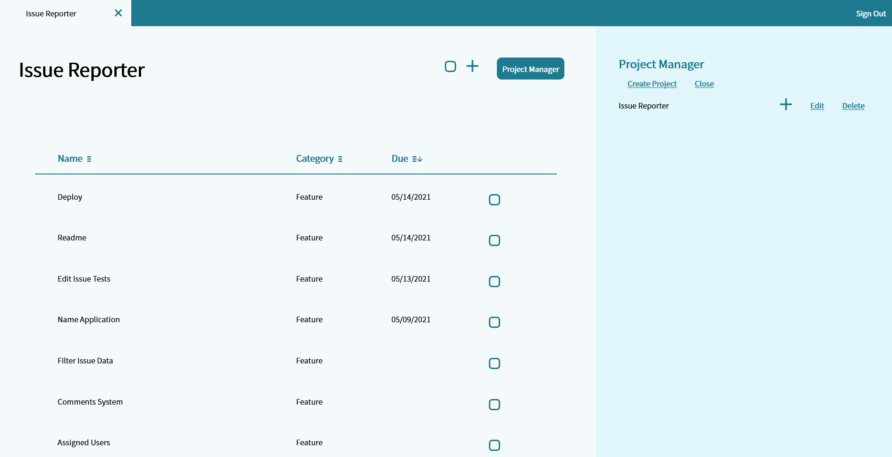

# Dev Issue Tracking

<!-- //TODO: update deployment link -->
<!-- [View Dev Issue Tracking]() -->

## Description

Dev issue tracker is a resource for organizing bugs, issues, and features on development projects. Users can create multiple projects, and create bug and feature records with detailed descriptions, categories, and due dates.

## Table of Contents

<!-- * [Installation](#Installation) -->
<!-- * [Usage](#Usage) -->

- [Technologies](#Technologies)
- [License](#License)
- [Contact](#Contact)

<!-- ## Installation -->

<!-- ## Usage -->

## Technologies

- React
- Sass
- NodeJS
- Express
- Mongoose
- JWT

## License

Dev Issue Tracking is licensed under the [MIT](https://opensource.org/licenses/MIT) license.

## Contact

Contact me at:

- Github: [https://github.com/nbur4556](https://github.com/nbur4556)
- Email: nbur4556@gmail.com
